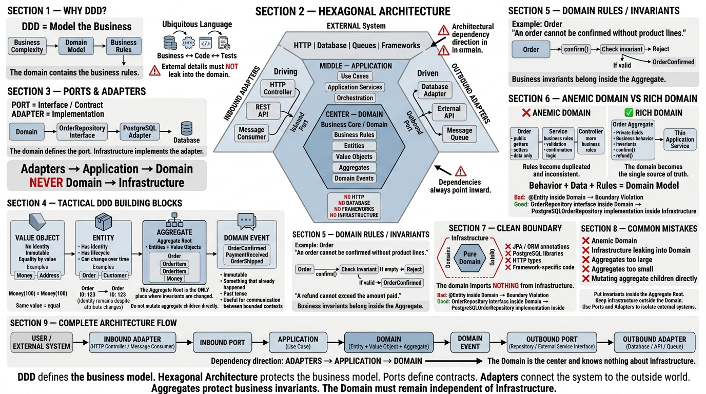
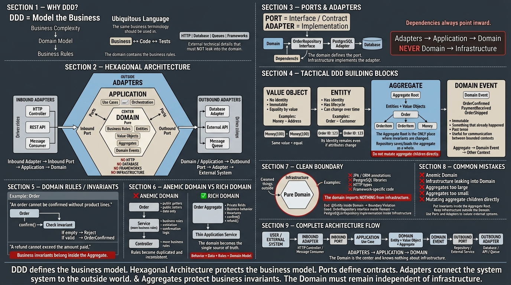

# Weekly Status - Week 03

<!-- CONFIG-START - debe coincidir con el CONFIG de tu repo de perfil (username/username) -->

* FULL_NAME: Yeferson Esmid Heredia Perdomo
* GITHUB_USER: Yefersom10
* TEAM: CineSync Platform
* SPRINT_GOAL: Analyze and prepare the documentation, architectural, and operational structure of the CineSync Platform project, establishing CSP-Docs as the single source of truth, understanding DDD and Hexagonal Architecture, and defining service design principles.
<!-- CONFIG-END -->

## 1. User stories worked this week

| HU ID | Title                                         | Status (todo/doing/done) | Evidence (PR or commit URL) |
| ----- | --------------------------------------------- | ------------------------ | --------------------------- |
| N/A   | No user stories were developed during Week 03 | N/A                      | N/A                         |

> **Note:** According to the team's planning, user stories will begin to be added and worked on during Week 04. Week 03 was focused on project organization, documentation, architecture, and planning.

## 2. My individual contribution

* Reviewed the structure and purpose of the **CSP-Docs** repository as the team's central documentation repository and **Single Source of Truth (SSOT)**.
* Analyzed the documentation structure based on the numbered folders from `00-governance` to `15-project-control`, together with `99-archive` for historical documentation.
* Reviewed the purpose of `00-governance`, understanding that it establishes the project's general rules, conventions, Definition of Ready, Definition of Done, documentation standards, and security policies.
* Reviewed the documentation areas that will be developed next:

  * `01-context`
  * `02-domain`
  * `03-product`
  * `04-requirements`
* Reviewed the concept of **Ubiquitous Language** and its importance for maintaining the same business terminology across conversations, documentation, code, and tests.
* Reviewed the concept of **UUID (Universally Unique Identifier)** as an identifier suitable for distributed systems where unique identification of resources is required.
* Studied **Domain-Driven Design (DDD)** and its tactical building blocks:

  * Entities
  * Value Objects
  * Aggregates
  * Domain Events
* Studied **Hexagonal Architecture**, including:

  * Ports and adapters
  * Inbound and outbound adapters
  * Dependency rule
  * Separation between domain, application, and infrastructure
* Identified the importance of keeping the domain independent from infrastructure, databases, HTTP frameworks, and other I/O technologies.
* Reviewed **service design, data ownership, and contracts**.
* Identified the principle that each piece of data should have exactly **one owning service**.
* Reviewed the difference between synchronous contracts such as REST/gRPC and asynchronous communication through domain events.
* Reviewed the purpose of an **Anti-Corruption Layer (ACL)** to prevent external models from leaking into the internal domain.
* Reviewed the concept of **vertical slicing** for MVP development, focusing on small end-to-end features that can be demonstrated and tested.
* Participated in the team's weekly presentation, where the four APIs proposed for the project were presented.
* Identified the professor's main observation during the presentation: although the distribution of the four APIs was appropriate, the architectural decision still needed to be supported by an **ADR (Architecture Decision Record)**.
* Reviewed the **Scrum and Kanban** diagrams and discussed how these methodologies relate to the team's workflow.
* Participated in the creation and organization of the team's project board, which will be used to manage the user stories and tasks starting in Week 04.

## 3. Blockers and risks

* No user stories were implemented during Week 03 because the team will begin adding and working on them in Week 04.
* The architectural distribution of the four APIs still needs to be formally documented through an **ADR**.
* The responsibilities and data ownership of each service must be clearly defined before implementation to avoid shared databases and distributed-monolith problems.
* Service contracts still need to be defined before the services are implemented.
* The team must establish a common **Ubiquitous Language** to avoid inconsistencies between the documentation, domain model, APIs, and code.
* The relationship between the bounded contexts and the four APIs must be validated before the first vertical slices are implemented.
* There is a risk of defining service boundaries only from a technical perspective instead of basing them on business responsibilities and data ownership.

## 4. Plan for next week

* Begin creating and defining the first **user stories** in the project board.
* Define testable acceptance criteria for the first stories.
* Start working with the documentation folders:

  * `01-context`
  * `02-domain`
  * `03-product`
  * `04-requirements`
* Document the general context and scope of CineSync Platform.
* Identify the main domain concepts and establish the project's Ubiquitous Language.
* Begin defining the product vision, backlog, and initial roadmap.
* Organize functional and non-functional requirements.
* Create the **ADR** that justifies the distribution of the four APIs.
* Define data ownership for the main entities handled by each service.
* Begin defining the contracts between services, including synchronous APIs and asynchronous events where necessary.
* Identify where an Anti-Corruption Layer may be required.
* Select the first vertical slice for MVP 1 and convert it into testable user stories.
* Start implementing the first stories while respecting DDD and Hexagonal Architecture principles.

## 5. Compliance self-check

* [ ] Conventional Commits - `type(scope): summary`
* [ ] Per-environment HU branch + PR to that environment (`hu-xxx-dev -> develop`, ...)
* [ ] Testable acceptance criteria
* [ ] Tests added/updated (unit / integration)
* [x] DDD / hexagonal boundaries respected (domain has no I/O)
* [x] No secrets; config via environment variables

### Notes

* No user stories were worked on during Week 03 because the team will begin working with HUs in Week 04.
* The main activities of this week were architectural analysis, documentation planning, project organization, and methodology review.
* The project board was created and prepared to manage the user stories and tasks that will be added in Week 04.
* The professor identified the need for an **ADR** to justify the distribution of the four APIs.
* DDD and Hexagonal Architecture were reviewed as the architectural principles that will guide the development of the services.
* Service design, data ownership, contracts, ACLs, and vertical slicing were studied as preparation for defining the first MVP features.

## 6. Evidence links

### 1. Distributed Architectures and Architecture Planning

This diagram was created during the previous learning activities and represents the concepts related to distributed architectures and architectural planning that were used as a foundation for the project's architecture.




### 2. Domain-Driven Design & Hexagonal Architecture

The Week 03 material introduced DDD and Hexagonal Architecture as the foundation for maintaining a clean and maintainable distributed system.


The main architectural rule identified was:

> Dependencies must point inward: adapters → application → domain.

The domain should not depend on databases, HTTP frameworks, ORM annotations, queues, or other infrastructure technologies.

### 3. Service Design, Data Ownership and Contracts

The second Week 03 session focused on transforming bounded contexts into concrete service boundaries.



The main principles reviewed were:

```text
Bounded Context
       │
       ▼
Service
       │
       ├── Owns its data
       │
       ├── Exposes contracts
       │
       ├── Publishes events when appropriate
       │
       └── Protects its domain
```

The main rule for data ownership is:

> Each piece of data has exactly one owning service.

Other services should not directly access the owner's database. They must communicate through a defined contract.

Service contracts must define:

```text
Method / Path or Event
        │
        ▼
Request
        │
        ▼
Response
        │
        ▼
Errors
        │
        ▼
Version
```

The session also introduced the **Anti-Corruption Layer (ACL)** as a mechanism for translating external or legacy models so that they do not leak into the internal domain.

Finally, the concept of **vertical slicing** was reviewed. Instead of organizing a sprint around technical layers, the team should work on small end-to-end features that can be implemented, tested, and demonstrated.

### 5. Weekly Team Review

During the weekly team review, the **CineSync Platform** team presented the work completed during the previous week and the proposed distribution of the four APIs.

The distribution was considered appropriate, but an important architectural question was raised:

```text
Four APIs
   │
   ▼
Responsibilities defined
   │
   ▼
Service boundaries defined
   │
   ▼
Where is the ADR?
   │
   ▼
Document and justify
the architectural decision
```

This feedback established an important action for the project: the distribution of the four APIs must be supported by an **ADR** explaining the context, decision, alternatives, and consequences.

### 6. Project Board

During Week 03, the team created and organized the project board that will be used to manage the development workflow.

The board will become the main workspace for the team's user stories and tasks starting in Week 04.

The workflow will connect:

```text
User Stories
     │
     ▼
Tasks
     │
     ▼
GitHub Project Board
     │
     ▼
Branches
     │
     ▼
Pull Requests
     │
     ▼
Review
     │
     ▼
Testing
     │
     ▼
Done
```
