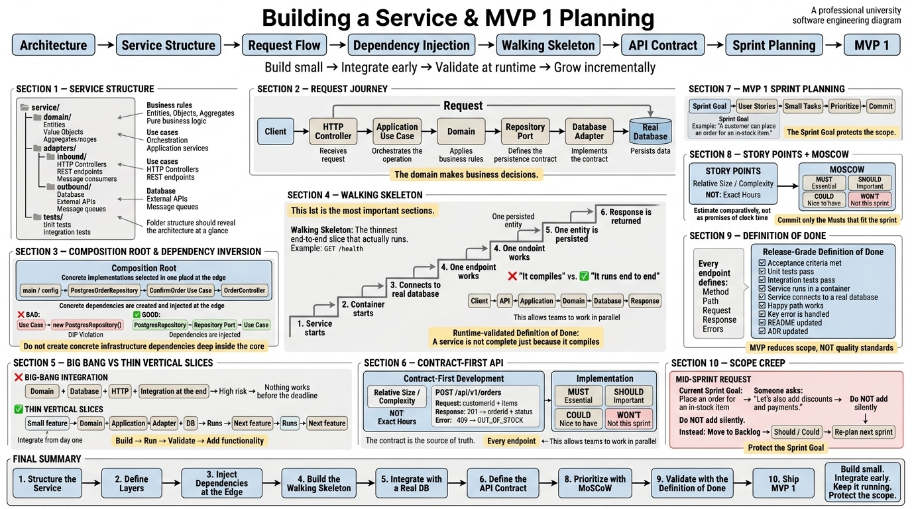

# Weekly Status - Week 04

<!-- CONFIG-START - must match your profile repo (username/username) CONFIG -->

* FULL_NAME: Yeferson Esmid Heredia Perdomo
* GITHUB_USER: Yefersom10
* TEAM: CineSync Platform
* SPRINT_GOAL: Start implementing user stories in CineSync Platform, consolidate the documentation for folders 00 to 04, begin working on 05-architecture and 06-data, and develop the initial Design System and visual identity for the project.

<!-- CONFIG-END -->

## 1. User stories worked this week

| HU ID     | Title                                                   | Status (todo/doing/done) | Evidence (PR or commit URL)       |
| --------- | ------------------------------------------------------- | ------------------------ | --------------------------------- |
| HU-UI-001 | Definition of Design System, Branding and Visual Tokens | doing                    | In Review - pending team approval |
| HU-UI-002 | Interactive Monolithic Mockup & GitHub Pages Deployment | doing                    | Being developed by a team member  |

> **Note:** HU-UI-001 already has the deliverables defined in its acceptance criteria implemented. It is currently **In Review**, pending review and approval from two team members.

## 2. My individual contribution

* I was responsible for **HU-UI-001 - Definition of Design System, Branding and Visual Tokens**.
* I defined the initial visual identity of **CineSync Platform**, including colors, styles, and visual guidelines to maintain consistency throughout frontend development.
* I created `12-ux-ui/design-system.md`, which documents the Design System and the visual elements defined for the project.
* I defined the visual tokens required for frontend components to use centralized and reusable values.
* I worked on the color palette and visual styles that will be used throughout the platform.
* I created `12-ux-ui/navigation-map.md` to document the initial navigation map of the platform.
* I created and organized the graphic resources structure in the `assets/` folder located at the root of the `csp-docs` repository.
* I organized the resources related to the CineSync Platform logo and visual identity.
* The following graphic resources were added:

  * `favicon-csp-32x32.png`
  * `icon-csp-black_and_white.png`
  * `icon-csp-black_and_white.svg`
  * `icon-csp-white_and_black.png`
  * `icon-csp.png`
  * `icon-csp.svg`
  * `logo-csp-.png`
* I verified that the developed deliverables comply with the acceptance criteria defined for HU-UI-001.
* I prepared the user story for review by two team members before marking it as completed.
* I reviewed the team's work related to folders `00` to `04` and the beginning of work on `05-architecture` and `06-data`.
* I participated in the week's activities related to **DDD** and software engineering applied to the projects being developed.

## 3. Blockers and risks

* **HU-UI-001** is currently under review and requires approval from two team members before it can be moved to `done`.
* **HU-UI-002** depends on HU-UI-001 because the interactive mockup must use the tokens and styles defined in the Design System.
* Visual tokens must remain centralized to prevent individual frontend components from defining inconsistent colors or styles.
* The definition of folders `05-architecture` and `06-data` is still in progress and must remain aligned with the decisions made during previous weeks.
* The visual identity must remain consistent across future screens, components, and mockups.

## 4. Plan for next week

* Address any feedback that may arise during the review of **HU-UI-001**.
* Obtain approval from the two team members responsible for reviewing the user story.
* Move HU-UI-001 to `done` once the review conditions are satisfied.
* Continue supporting the implementation of the Design System in frontend components.
* Review that the development of HU-UI-002 correctly uses the tokens and styles defined in `12-ux-ui/design-system.md`.
* Continue organizing and documenting folders `05-architecture` and `06-data`.
* Support the definition of upcoming user stories according to the team's project needs.

## 5. Compliance self-check

* [x] Conventional Commits - `type(scope): summary`
* [x] Testable acceptance criteria
* [ ] Tests added/updated (unit / integration)
* [x] DDD / hexagonal boundaries respected (domain has no I/O)
* [x] No secrets; configuration via environment variables

### Notes

* This week marked the official beginning of work with user stories.
* My main responsibility was **HU-UI-001**, related to the Design System, branding, and visual tokens.
* The main HU-UI-001 deliverables were created and uploaded to the `csp-docs` repository.
* The user story is currently **In Review**, pending approval from two team members.
* HU-UI-002 is being developed by another team member and depends on the tokens defined in HU-UI-001.
* The `csp-docs` repository does not use specific HU branches or environment-based PRs in this workflow.
* The work completed in `12-ux-ui` provides a centralized visual foundation for subsequent frontend development.

## 6. Evidence links

### HU-UI-001 — Design System

The main deliverables for this user story are located at:

```text
12-ux-ui/
├── design-system.md
└── navigation-map.md
```

The `design-system.md` file contains the Design System definition, including the visual elements and tokens that should be used to maintain interface consistency.

The `navigation-map.md` file contains the initial navigation map for CineSync Platform.

### Brand Assets

The graphic resources are organized in the `assets/` folder located at the root of the repository:

```text
assets/
└── logos/
    ├── favicon-csp-32x32.png
    ├── icon-csp-black_and_white.png
    ├── icon-csp-black_and_white.svg
    ├── icon-csp-white_and_black.png
    ├── icon-csp.png
    ├── icon-csp.svg
    └── logo-csp-.png
```

These resources allow the project's branding to be reused across different components, pages, and applications.

### HU-UI-002 — Interactive Monolithic Mockup

HU-UI-002 is currently being developed by another team member.

Its goal is to create an interactive mockup of the CineSync Platform flow and deploy it through GitHub Pages.

This user story uses the Design System defined in HU-UI-001 as a dependency.

### Weekly Activities

During this week, the teams presented how folders `00` to `04` were structured in the documentation repository.

Presentations were also given on:

* **Domain-Driven Design (DDD)**.
* **Software Engineering applied to the projects under development**.

Afterward, the teams were instructed to continue working on:

```text
05-architecture
06-data
```
### Week 04 Study Material

The following diagram summarizes the Week 04 study material related to **Building a Service and MVP 1 Planning**.




### Week Summary

Week 04 represented the transition from preparation and planning toward concrete work on **user stories**.

For CineSync Platform, two user stories related to the user experience and presentation of the system were started:

```text
HU-UI-001
    │
    ├── Design System
    ├── Branding
    ├── Visual Tokens
    ├── navigation-map.md
    └── Brand Assets
             │
             ▼
          In Review
             │
             ▼
      Team Approval
```

and:

```text
HU-UI-002
    │
    ├── Interactive Mockup
    ├── End-to-End Flow
    └── GitHub Pages
             │
             ▼
      Uses HU-UI-001
```

The main result of my work this week was establishing the **visual and design foundation of CineSync Platform**, documenting the tokens, styles, initial navigation, and branding resources that can be reused throughout frontend development.

The next step will be to complete the review of HU-UI-001 and continue evolving the Design System while the team progresses with the remaining user stories and the architecture and data documentation.
