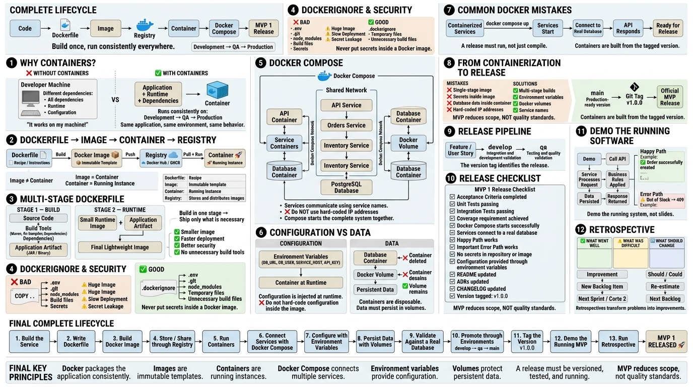

<!-- HU-STATUS TEMPLATE - do NOT remove the <!-- ... --> markers or the table headers.

```
 Your weekly grade is read AUTOMATICALLY from this file:
   05-week/hu-status/README.md (inside YOUR fork). English. -->
```

# Weekly Status - Week 05

<!-- CONFIG-START - must match your profile repo (username/username) CONFIG -->

* FULL_NAME: Yeferson Esmid Heredia Perdomo
* GITHUB_USER: Yefersom10
* TEAM: CineSync Platform
* SPRINT_GOAL: Define and document the architecture and domain diagrams for CineSync Platform while organizing the documentation repository structure from folders 07 to 10.

<!-- CONFIG-END -->

## 1. User stories worked this week

| HU ID       | Title                                     | Status (todo/doing/done) | Evidence (PR or commit URL)                         |
| ----------- | ----------------------------------------- | ------------------------ | --------------------------------------------------- |
| HU-ARCH-001 | CineSync Architecture and Domain Diagrams | done                     | Repository documentation: `08-uml/diagrams/source/` |

## 2. My individual contribution

* During Week 5, the team discussed important concepts related to distributed systems, including repositories and cross-cutting domains.
* The documentation repository structure was extended by organizing folders `07-api` through `10-devops`.
* I was responsible for working on the `08-uml` section of the CineSync Platform documentation repository.
* I completed **HU-ARCH-001 — CineSync Architecture and Domain Diagrams**.
* I worked on the diagram documentation required to represent the architecture, communication boundaries, workflows, domain lifecycle, events, and data ownership of the CineSync Platform MVP.
* The diagrams represent the CineSync microservices and their relationships with the API Gateway, Auth & User Service, Catalog & Showtimes Service, Booking & Seat Reservation Service, Notification & Ticket Service, RabbitMQ, SMTP, PostgreSQL, and MongoDB.
* The architecture documentation considers service boundaries and data ownership, avoiding direct cross-service database access.
* I reviewed the Week 5 learning material about **Containerization with Docker**.
* Based on the class material, I generated the diagram `complete-lifecyclo.jpeg`, which summarizes the containerization and MVP release lifecycle.
* The material covered Dockerfiles, images, containers, registries, Docker Compose, environment configuration, persistent volumes, and the MVP release lifecycle.
* I also reviewed the concepts related to releasing MVP 1, including acceptance criteria, testing, Docker Compose execution, environment configuration, documentation, ADRs, version tagging, demonstrations, and retrospectives.

## 3. Blockers and risks

* No major blockers prevented the completion of HU-ARCH-001.
* The main challenge is maintaining consistency between the architecture diagrams and the evolving implementation of the CineSync Platform.
* Future changes to service boundaries, contracts, events, or data ownership may require updates to the UML and architecture diagrams.
* The Docker and MVP release concepts studied this week will need to be applied consistently when the services are prepared for execution and deployment.

## 4. Plan for next week

* Continue maintaining and updating the architecture documentation as the CineSync Platform implementation evolves.
* Review the diagrams to ensure they remain consistent with the actual microservice architecture.
* Continue working on the documentation folders assigned to the team.
* Apply the containerization concepts by preparing Docker configurations for the services when required.
* Continue following the principles of service ownership, clear contracts, and isolated data boundaries.
* Support the preparation and implementation of the MVP according to the project requirements.

## 5. Compliance self-check

* [x] Conventional Commits - `type(scope): summary`
* [x] Testable acceptance criteria
* [x] DDD / hexagonal boundaries respected (domain has no I/O)
* [x] No secrets; config via environment variables

## 6. Evidence links

* CineSync UML and architecture documentation:

  `08-uml/diagrams/source/`

* User Story completed:

  **HU-ARCH-001 — CineSync Architecture and Domain Diagrams**

* Week 5 study material diagram — Containerization and MVP lifecycle:



* The Week 5 material covered:

  * Containerization with Docker.
  * Dockerfile, images, containers, and registries.
  * Multi-stage Docker builds.
  * Docker Compose for multi-service systems.
  * Environment-based configuration.
  * Persistent data using volumes.
  * MVP 1 release checklist and Definition of Done.
  * Promotion of releases and version tagging.
  * Working software demonstrations.
  * Retrospectives and continuous improvement.
