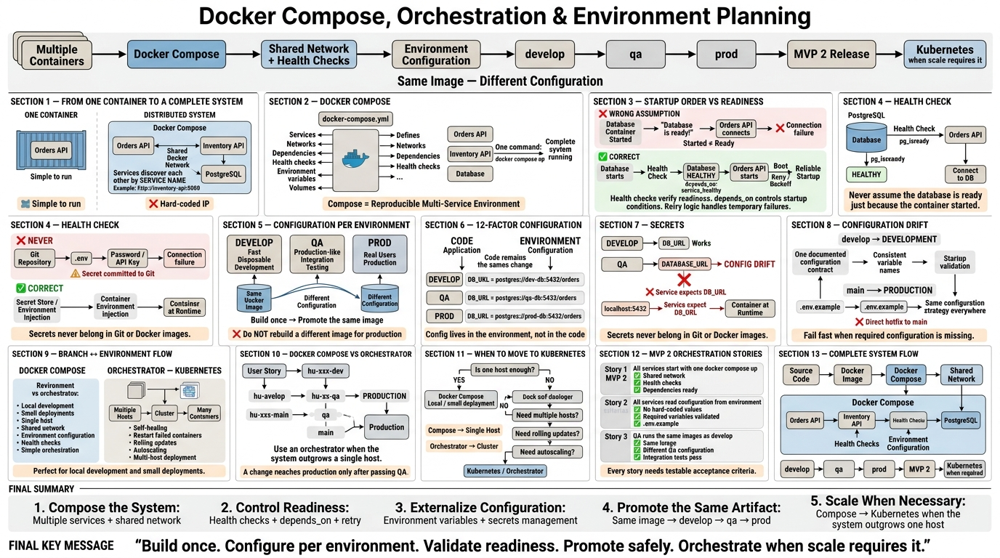

<!-- HU-STATUS TEMPLATE - do NOT remove the <!-- ... --> markers or the table headers.
     Your weekly grade is read AUTOMATICALLY from this file:
       06-week/hu-status/README.md  (inside YOUR fork). English. -->

# Weekly Status - Week 06

<!-- CONFIG-START - must match your profile repo (username/username) CONFIG -->
- FULL_NAME: Yeferson Esmid Heredia Perdomo
- GITHUB_USER: Yefersom10
-  TEAM: CineSync Platform
- SPRINT_GOAL: Defend and validate MVP 1 through the presentation of the booking flow and architecture, while studying Docker Compose, environment configuration, and orchestration concepts for the next stage.
<!-- CONFIG-END -->

## 1. User stories worked this week
| HU ID       | Title                                     | Status (todo/doing/done) | Evidence (PR or commit URL)                         |
| ----------- | ----------------------------------------- | ------------------------ | --------------------------------------------------- |
| HU-ARCH-001 | CineSync Architecture and Domain Diagrams | done                     | Repository documentation: `08-uml/diagrams/source/` |
## 2. My individual contribution

### MVP 1 Defense and Presentation

During the MVP 1 defense, I contributed to the technical presentation and explanation of the CineSync Platform architecture and booking workflow.

I specifically explained the asynchronous ticket generation flow and the reason why ticket generation is not part of the Booking transaction.

When asked:

> **Why is ticket generation asynchronous and not part of the Booking transaction?**

I explained:

> **“Booking must focus on the short transaction that is sensitive to concurrency. After confirmation, it publishes BookingConfirmed through an Outbox. Notification consumes the event through an Inbox, uses eventId to guarantee idempotency, generates the QR/PDF ticket, and sends the email without delaying or reverting the seat confirmation.”**

This contribution demonstrated how the architecture separates the critical booking transaction from the ticket generation and email notification processes.

### Docker Compose and Orchestration

I also studied and analyzed the Docker Compose and orchestration concepts required for the next stage of the project.

My contribution included understanding and documenting:

* How to start multiple services using a single `docker compose up`.
* How services communicate through a shared Docker network using service names.
* The difference between `depends_on` startup ordering and actual service readiness.
* The use of `healthchecks` and `condition: service_healthy`.
* Retry and backoff strategies for service communication.
* Environment-based configuration using environment variables.
* Keeping secrets outside the code and Docker images.
* Using volumes for persistent data.
* The role of orchestration platforms such as Kubernetes for multi-host deployments, self-healing, rolling updates, and autoscaling.

This work helped prepare the architecture and deployment strategy for the implementation of the next MVP.

---

## 3. Risks, Blockers, and Validation Points

- Keep REST contracts/events synchronized with the flows represented in the diagrams.
- Properly validate communication through `BookingConfirmed`.
- Guarantee idempotency using `eventId` through the Inbox pattern.
- Prevent ticket generation from blocking or reverting the confirmation of a reservation.
- Keep environment-specific configuration outside the code.
- Avoid hardcoded URLs, credentials, or sensitive configurations.
- Properly verify `healthchecks` and dependencies between containers.
- Maintain consistent configuration across environments to reduce configuration drift.

---

## 4. Next Steps

For the next stage, the following activities are planned:

- Start implementing the microservices defined in the architecture.
- Prepare the corresponding boilerplates for each service.
- Integrate Docker Compose to run the distributed system locally.
- Define environment variables and `.env.example` files.
- Add health checks and basic retry mechanisms.
- Continue applying DDD and Hexagonal Architecture during implementation.
- Implement and validate contracts between services.
- Continue with the User Stories corresponding to the next cut.
- Prepare the infrastructure required for MVP 2 and its subsequent deployment.

---

## 5. Quality and Process Self-Check

- [x] Conventional Commits applied.
- [x] DDD principles considered.
- [x] Hexagonal Architecture considered.
- [x] Separation of responsibilities between services.
- [x] Data ownership defined.
- [x] Asynchronous event processing considered.
- [x] Idempotency through `eventId` considered.
- [x] Secrets and credentials kept outside the code.
- [ ] Automated tests implemented for acceptance criteria.
- [ ] Test coverage validated.

> **Note:** The `csp-docs` repository does not use branches or Pull Requests, so the per-environment branch/PR criterion is not included for this documentation repository.

---

## 6. Evidence

### Docker Compose, Orchestration, and Environment Planning

This evidence corresponds to the material studied during the week on Docker Compose, environment configuration, health checks, service dependencies, and basic orchestration concepts.

### Architecture and MVP 1 Defense

The architecture and diagrams used during the defense are located at:

`08-uml/diagrams/source/`

These artifacts document the CineSync Platform architecture, main workflows, reservation lifecycle, events, and communication between services.