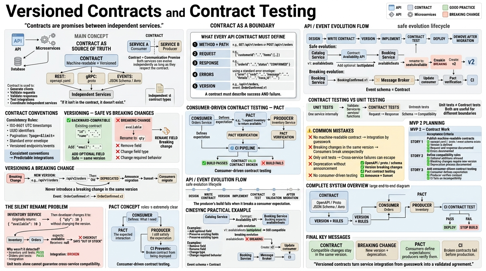

<!-- HU-STATUS TEMPLATE - do NOT remove the <!-- ... --> markers or the table headers.
     Your weekly grade is read AUTOMATICALLY from this file:
       07-week/hu-status/README.md  (inside YOUR fork). English. -->

# Weekly Status - Week 07

<!-- CONFIG-START - must match your profile repo (username/username) CONFIG -->
- FULL_NAME: Yeferson Esmid Heredia Perdomo
- GITHUB_USER: Yefersom10
- TEAM: CineSync Platform
- SPRINT_GOAL: Complete and align the project's technical documentation, ensuring full traceability of Architectural Decision Records (ADRs), microservices specifications, communication contracts, and the integration of concepts regarding synchronous/asynchronous communication and contract testing.
<!-- CONFIG-END -->

## 1. User stories worked this week
| HU ID | Title | Status (todo/doing/done) | Evidence (PR or commit URL) |
|---|---|---|---|
| HU-ARCH-002 | Microservices Specifications and Readiness | done | https://github.com/code-corhuila/csp-docs/commits/main |
| HU-ARCH-001 | CineSync Architecture and Domain Diagrams | done | https://github.com/code-corhuila/csp-docs/tree/main/08-uml/diagrams/source |

## 2. My individual contribution
- Updated and standardized general technical documentation within the `csp-docs` repository.
- Ensured system-wide ADR traceability by correcting the reference path to `ADR-004` and logging a formal restoration note in `ADR-002`.
- Aligned UX/UI documentation with conceptual and architectural diagrams defined in `HU-ARCH-001`.
- Applied formatting patches across DevOps documentation and standardized resource naming conventions using the `<abbr>-<domain>-<piece>` pattern.
- Documented the responsibility allocation matrix (5-owner matrix) alongside strict database isolation per microservice.
- **Class Material Integration (Inter-service communication & Versioned Contracts):**
  - Evaluated and integrated synchronous (REST / gRPC) and event-driven asynchronous (Pub/Sub via Broker) communication patterns based on the decision framework learned in class.
  - Designed specifications aligned with *at-least-once* delivery semantics and the explicit requirement for idempotent consumer processing.
  - Formalized API contract versioning rules (preventing breaking changes by adding optional fields) and prepared the structure for consumer-driven contract testing (Pact/CI).

### Commits with Direct Evidence
- [`1ac0f6b`](https://github.com/code-corhuila/csp-docs/commit/1ac0f6befa5a8332cf9e8cb8896d485232665576) — `docs(architecture,ux-ui,devops,domain): align ADR traceability and documentation standards`
- [`78f0369`](https://github.com/code-corhuila/csp-docs/commit/78f036905795c4ec71c8fffba164b3e97726a4de) — `docs(domain,arch): fix ADR-004 link path and add restoration note to ADR-002`
- [`b8b3281`](https://github.com/code-corhuila/csp-docs/commit/b8b328191e3e55de4a213350d47fdc49b4e47294) — `docs(ux-ui,devops): standardize ux-ui to HU-ARCH-001 and apply formatting patches to devops`
- [`35a5b8b`](https://github.com/code-corhuila/csp-docs/commit/35a5b8b704147fcfdb4319a9895aa8959b607731) — `Merge pull request #13 from code-corhuila/docs/update-devops`
- [`66b3c47`](https://github.com/code-corhuila/csp-docs/commit/66b3c477c150931c881083cea4f92aeeb851a2bd) — `fix(devops): standardize naming convention to <abbr>-<domain>-<piece>, 5-owner matrix, and database isolation`
- [`f9f4a54`](https://github.com/code-corhuila/csp-docs/commit/f9f4a5426084ad85c9c6ac5df6baa2eea8d88fe2) — `docs(devops): fix repository names to align with git-conventions`

## 3. Blockers and risks
- Maintaining consistency across diagrams (`08-uml/`), specifications (`09-microservices/`), and API contracts (`07-api/`) requires continuous validation whenever structural changes occur.
- Preventing cascading failures across long synchronous chains requires configuring timeouts, circuit breakers, and offloading non-critical paths to asynchronous events.
- Ensuring idempotency in consumers to safely handle duplicate message delivery without corrupting domain state or consistency.
- Enforcing backward-compatible contract evolution to avoid breaking cross-team integrations unexpectedly (*silent renames*).

## 4. Plan for next week
- Complete detailed microservices specifications in `09-microservices/`, formalizing contracts via OpenAPI (`openapi.yaml`) and gRPC (`.proto`).
- Establish strict backward compatibility and versioning rules (`/api/v1`, `/v2`) for endpoints and event schemas.
- Set up consumer-driven contract testing using Pact to integrate verification into the Continuous Integration (CI) pipeline.
- Design idempotency key strategies for asynchronous messaging consumers.
- Validate final consistency between UML diagrams (`08-uml/`) and formalized repository contracts.

## 5. Compliance self-check
- [x] Conventional Commits - `type(scope): summary`
- [x] Per-environment HU branch + PR to that environment (hu-xxx-dev -> develop, ...)
- [x] Testable acceptance criteria
- [ ] Tests added/updated (unit / integration)
- [x] DDD / hexagonal boundaries respected (domain has no I/O)
- [x] No secrets; config via environment variables

## 6. Evidence links
- Primary Documentation Repository: https://github.com/code-corhuila/csp-docs
- Architecture and Domain Diagrams: https://github.com/code-corhuila/csp-docs/tree/main/08-uml/diagrams/source
- Microservices Specifications: https://github.com/code-corhuila/csp-docs/tree/main/09-microservices
- Pull Request #13 (DevOps Update): https://github.com/code-corhuila/csp-docs/pull/13
- Class Material - `Inter-Service Communication Diagram`:

- Class Material - `Versioned Contracts Diagram`:

