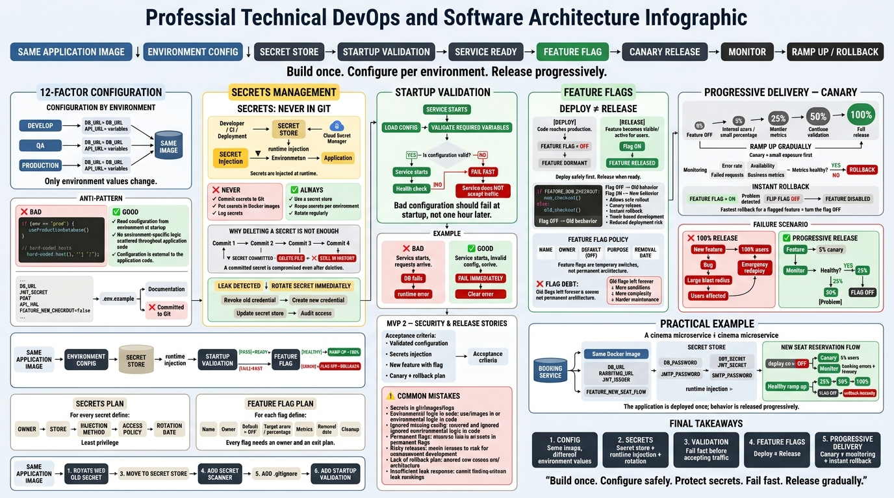

markers or the table headers.
     Your weekly grade is read AUTOMATICALLY from this file:
       09-week/hu-status/README.md  (inside YOUR fork). English. -->

# Weekly Status - Week 09

- FULL_NAME: Yeferson Esmid Heredia Perdomo
- GITHUB_USER: Yefersom10
- TEAM: CineSync Platform
- SPRINT_GOAL: Implement 12-factor configuration, fail-fast startup validation, and environment secret boundaries; refine Cut 2 user stories and base scaffolds across microservices; align data dictionaries, gateway routes, and deployment topologies for Cut 2 readiness.

## 1. User stories worked this week
| HU ID | Title | Status (todo/doing/done) | Evidence (PR or commit URL) |
|---|---|---|---|
| HU-BOOKING-001 | Client Creates a Temporary Seat Hold | doing | https://github.com/code-corhuila/csp-booking-api/issues/8 |
| HU-FE-TICKETING-001 | Frontend Ticket Renders Synthetic Data | doing | https://github.com/code-corhuila/csp-ticketing-portal/pull/2 |
| HU-BOOKING-002 | Expired Hold Releases Seats | todo | https://github.com/code-corhuila/csp-booking-api/issues/9 |
| HU-BOOKING-003 | Client Confirms a Reservation | todo | https://github.com/code-corhuila/csp-booking-api/issues/10 |

## 2. My individual contribution
- **12-Factor Configuration, Secrets & Startup Validation (Fail-Fast):**
  - Configured `JwtKeyConfiguration.java` in `csp-booking-api` to enforce strict startup validation (`IllegalStateException`) if `JWT_PUBLIC_KEY` or `JWT_PUBLIC_KEY_FILE` is missing, unreadable, or invalid RSA. The service halts immediately on boot if configuration is incomplete.
  - Created `.env.example` templates across services specifying environment variables (`JWT_PUBLIC_KEY`, `SPRING_DATASOURCE_*`, `PORT`) using placeholders only—never committing real secrets.
  - Declared `application.yml` resource limits and exposed `/actuator/health/liveness` and `/actuator/health/readiness` endpoints.
  - Configured `CorrelationIdFilter.java` to inject correlation IDs into all application log lines at the filter layer.
  - Authored `05-architecture/deployment.md` establishing the core security rule: credentials live in secret managers per environment (never in Git), and database schema permissions are validated during environment provisioning.
- **Microservices Architecture & Cut 2 Alignment:**
  - Authored **ADR-011** (Integer Cents Monetary Standard) and aligned C4 views, API Gateway routing tables, and Auth data models across all OpenAPI specs (`/api/v1/{service}`).
  - Created the global data dictionary (`06-data/data-dictionary.md`) and global deployment topology (`05-architecture/deployment.md`).
  - Standardized multi-document database topology descriptions to reflect shared PostgreSQL instances with strict schema isolation (ADR-006).
  - Updated `00-governance/branching-policy.md` incorporating the `qa-promote/` branch naming convention ratified in ADR-021.
  - Scaffolding of `csp-ticketing-portal` with Angular structure and CI lockfiles.

### Commits with Direct Evidence
- **csp-docs:**
  - [`6453757`](https://github.com/code-corhuila/csp-docs/commit/645375720ea56821c80eb131870a24c82272529f) — `docs(product): add product backlog aligned with vision and user stories`
  - [`885e829`](https://github.com/code-corhuila/csp-docs/commit/885e829e22b1a5b17ada63e073ef591cda59dc00) — `docs(architecture): add deployment.md describing environment-level database infrastructure`
  - [`745b68e`](https://github.com/code-corhuila/csp-docs/commit/745b68ec8e72c4903e8a50e9d301a1c495201f31) — `docs(data): create global data-dictionary.md for all service schemas and collections`
  - [`e06bd07`](https://github.com/code-corhuila/csp-docs/commit/e06bd076ea21ccee719069ffaa34863bc27b8b93) — `docs(product): merge PR #31 from code-corhuila/docs/add-product-backlog`
  - [`e423641`](https://github.com/code-corhuila/csp-docs/commit/e4236417e2837bb2d209abe4a16e138f3ca5d9e2) — `docs(architecture): merge PR #33 for deployment topology and global data dictionary`
  - [`0b9c519`](https://github.com/code-corhuila/csp-docs/commit/0b9c51957a1273ad38d1e74753aea0a295bbe1ca) — `docs(data): align physical models with API contracts and cents standard`
  - [`48b5796`](https://github.com/code-corhuila/csp-docs/commit/48b5796a22b1ac7c81cc9e7660a4aef96ab4b470) — `docs(architecture): merge PR #36 for architecture, gateway, and governance alignment`
  - [`f302554`](https://github.com/code-corhuila/csp-docs/commit/f302554cccdc10489f90df9d61a8ff4b0722f7e2) — `docs(architecture): merge PR #40 for ADR-011, architecture, gateway, and auth traceability alignment`
  - [`e359279`](https://github.com/code-corhuila/csp-docs/commit/e359279e7ed6db0213321f7e192d15cea30f396b) — `docs(architecture): add ADR-011, align C4 views, routing, and auth data model`
  - [`83fcb51`](https://github.com/code-corhuila/csp-docs/commit/83fcb51a5dd5bfaf128d0d996777e42e3ceef6f4) — `docs(governance): align database topology wording with ADR-006 shared instance`
  - [`f1d4b3d`](https://github.com/code-corhuila/csp-docs/commit/f1d4b3d63b973a6feecd65a03a9843d676ccfdf7) — `docs(governance): Pr #42 align database topology wording with ADR-006 shared instance`
  - [`6030e4e`](https://github.com/code-corhuila/csp-docs/commit/6030e4e6fcc5c83a986d89a51a6f20872acde94c) — `docs(api): enforce /api/v1/{service} base paths and complete gateway routing table`
  - [`5f0c690`](https://github.com/code-corhuila/csp-docs/commit/5f0c690ebdafb7ca733cedae142dc0ae73be38b7) — `docs(api): merge Pr #43 enforce /api/v1/{service} base paths and complete gateway routing table`
  - [`ae73e58`](https://github.com/code-corhuila/csp-docs/commit/ae73e585d48f80b3e177a3d960070240b77fe8e5) — `docs(governance): point the branching policy at the qa-promote prefix of ADR-021`
  - [`edd534b`](https://github.com/code-corhuila/csp-docs/commit/edd534bcd724d651b923d0b3558492f594030016) — `merge main into docs/branching-policy-qa-promote: keep both ADR register rows`
  - [`99e212a`](https://github.com/code-corhuila/csp-docs/commit/99e212abdc823addf370ca8f124993ab4dfa9827) — `docs(governance): explain -m 1 and cite the numerals behind the trail`
- **csp-booking-api & csp-ticketing-portal:**
  - [`dbe5fb9`](https://github.com/code-corhuila/csp-booking-api/commit/dbe5fb99c4f25572e35730cda5c785b42792b400) — `docs(pr-template): point the user story field to the in-repo issue`
  - [`c894418`](https://github.com/code-corhuila/csp-booking-api/commit/c89441869ed2502884f0b5faecd2cdcfb340bf9a) — `docs(pr-template): merge PR #11`
  - [`6c31b4b`](https://github.com/code-corhuila/csp-booking-api/commit/6c31b4b3a14f8f90cb06d619d75ee8369381686a) — `docs(pr-template): merge PR #11 (promotion branch)`
  - [`f39fb87`](https://github.com/code-corhuila/csp-booking-api/commit/f39fb8727ae6c73ac6d1af7558e8ecb9004bd9f6) — `Merge pull request #14 (segment 1 to qa)`
  - [`c9856f6`](https://github.com/code-corhuila/csp-booking-api/commit/c9856f641fd4f8f2ba7ceb54c605185463c18ad4) — `Merge pull request #15 (segment 2 to qa)`
  - [`469db21`](https://github.com/code-corhuila/csp-ticketing-portal/commit/469db2185191a9b4ec2351c8440e99b55b12c896) — `chore(ticketing): scaffold portal skeleton from the Angular template`
  - [`d286b44`](https://github.com/code-corhuila/csp-ticketing-portal/commit/d286b44763f2ca32c1e7bbfc0508cacefb3ed991) — `build(ticketing): add npm lockfile for CI`
  - [`1cd144a`](https://github.com/code-corhuila/csp-ticketing-portal/commit/1cd144a72fc71e7dea7e0c89bbddf06f5ffde03b) — `chore(ticketing): scaffold portal skeleton (merge PR #2)`
  - [`3ff7267`](https://github.com/code-corhuila/csp-ticketing-portal/commit/3ff7267c72933ed208aa982e249d16c7778a9c02) — `chore(ticketing): scaffold portal skeleton (promotion branch)`

## 3. Blockers and risks
- Local unpushed implementation commits on `HU-BOOKING-001` and `csp-booking-db` must be pushed to remote feature branches before creating official Pull Requests to prevent data loss.
- Working tree uncommitted files (`CreateHoldRequest.java`, `ReservationController.java`, `ReservationResponse.java`) in `csp-booking-api` require staging into dedicated atomic commits adhering to size guidelines (< 400 lines non-test per PR).
- Git branch naming restrictions (`qa/` prefix ref lock issue) were mitigated using `qa-promote/` as codified in ADR-021; ongoing team alignment is required during PR promotions.
- Absence of an explicit Feature Flag ADR in `csp-docs`: if progressive delivery is enforced for Cut 2 releases, an architecture decision record must be drafted.

## 4. Plan for next week
- Stage, commit, and push pending implementation files for `HU-BOOKING-001` in `csp-booking-api` and open PR to `develop`.
- Push database migration tables (`seat_hold`, `reservation`, `idempotency_key`, `outbox_event`) in `csp-booking-db` and submit PR to `develop`.
- Complete transactional persistence tests in `JdbcHoldRepository` ensuring zero double-booking concurrency guarantees.
- Implement expiration logic in worker service for `HU-BOOKING-002` and idempotent reservation confirmation for `HU-BOOKING-003`.
- Finalize promotion PRs (`csp-booking-db` #11 and `csp-ticketing-portal` #4) to `qa`.
- Prepare Cut 2 release workflow and integrate real API endpoints into `csp-booking-portal`.

## 5. Compliance self-check
- [x] Conventional Commits - `type(scope): summary`
- [x] Per-environment HU branch + PR to that environment (hu-xxx-dev -> develop, ...)
- [x] Testable acceptance criteria
- [ ] Tests added/updated (unit / integration)
- [x] DDD / hexagonal boundaries respected (domain has no I/O)
- [x] No secrets; config via environment variables

## 6. Evidence links
- Primary Documentation Repository: https://github.com/code-corhuila/csp-docs
- Pull Request #31 (Product Backlog): https://github.com/code-corhuila/csp-docs/pull/31
- Pull Request #33 (Deployment & Data Dictionary): https://github.com/code-corhuila/csp-docs/pull/33
- Pull Request #36 (Physical Models & Cents Standard): https://github.com/code-corhuila/csp-docs/pull/36
- Pull Request #40 (ADR-011 & Gateway Routing): https://github.com/code-corhuila/csp-docs/pull/40
- Pull Request #42 (Shared Postgres Topology Alignment): https://github.com/code-corhuila/csp-docs/pull/42
- Pull Request #43 (Base Paths & Gateway Routing Table): https://github.com/code-corhuila/csp-docs/pull/43
- Pull Request #88 (Branching Policy QA-Promote): https://github.com/code-corhuila/csp-docs/pull/88
- Ticketing Portal Scaffold PR #2: https://github.com/code-corhuila/csp-ticketing-portal/pull/2
- Booking API Scaffold PR #11: https://github.com/code-corhuila/csp-booking-api/pull/11
- Booking API Promotion PR #14: https://github.com/code-corhuila/csp-booking-api/pull/14
- Booking API Promotion PR #15: https://github.com/code-corhuila/csp-booking-api/pull/15
- Class Material Diagram - Configuration, Secrets and Feature Flags:

